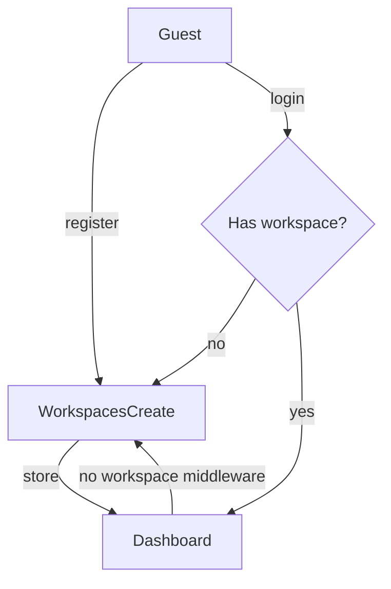

# TMS — Project Documentation

**Project:** TMS (Task Management System)  
**Last updated:** August 31, 2026 (evening — Phase E + UI polish complete)  
**Stack:** Laravel 12, Livewire 4.3, Tailwind CSS 4, Vite 7, MySQL  
**Database:** `task_management`

---

## Current State (August 31, 2026)

The app is a **full-featured ClickUp-style task manager** with auth, multi-workspace support, Kanban + list views, drag-and-drop, comments, tags, notifications, subtasks, activity log, and custom status columns.

```
Register / Login → Workspace Create → Dashboard (Board or List)
                      ↓
              Multi-workspace switcher (sidebar list)
```

| Feature | Status |
|---------|--------|
| Auth (register, login, logout) | ✅ |
| Multi-workspace create + switch | ✅ |
| Workspace rename settings | ✅ |
| Custom board columns CRUD | ✅ `/workspaces/settings/statuses` |
| Status columns seeded per workspace | ✅ |
| Kanban board with drag-and-drop | ✅ |
| Task list view (search, sort) | ✅ |
| Task create / edit / delete (modal) | ✅ |
| Assignee picker | ✅ |
| Tags + comments | ✅ |
| Subtasks (modal; hidden from board/list) | ✅ |
| Activity log (collapsible in modal) | ✅ |
| Notifications (bell in page header) | ✅ |
| Collapsible sidebar + mobile bottom nav | ✅ |
| ARPA branding + brand color palette | ✅ |
| Forgot password, email verification | ❌ Out of scope |

**39 tests passing** — run `php artisan test`

**Optional follow-up:** workspace delete, dashboard charts, separate task detail page, API auth.

---

## Table of Contents

1. [Current State](#current-state-august-31-2026)
2. [Session Overview](#session-overview)
3. [Initial Project Discovery](#initial-project-discovery)
4. [Planning Phase](#planning-phase)
5. [Implementation Phase — Auth & Onboarding](#implementation-phase)
6. [Issues Encountered and Fixes](#issues-encountered-and-fixes)
7. [Flow Evolution](#flow-evolution)
8. [Final Architecture](#final-architecture)
9. [August 23 Session — Dashboard, Tasks, List View](#august-23-session--dashboard-tasks-list-view)
10. [August 23 Session — Phase D: Kanban Drag-and-Drop](#august-23-session--phase-d-kanban-drag-and-drop)
11. [August 31 Session — Phase E + UI Polish](#august-31-session--phase-e--ui-polish)
12. [Files Inventory](#files-inventory)
13. [Testing](#testing)
14. [Out of Scope / Remaining Work](#out-of-scope--remaining-work)
15. [Phase Plan Reference](#phase-plan-reference)
16. [Reference Documents Used](#reference-documents-used)
17. [How to Run Locally](#how-to-run-locally)
18. [Summary](#summary)

---

## Session Overview

### August 7, 2026 — Auth & onboarding

This session took the TMS project from a **fresh Laravel 12 scaffold** with no auth or domain logic to a **working onboarding flow**:

```
Register / Login → Workspace Creation → Dashboard
```

Work included:

- Reading and evaluating external planning docs
- Choosing Livewire over controller-based auth
- Implementing database schema, models, middleware, Livewire components, minimal UI, routes, and tests
- Fixing a redirect loop on workspace creation
- Removing the mandatory password-change step per user request

### August 23, 2026 — Dashboard, domain, tasks, list view

Extended the app from onboarding-only to a functional task manager:

- **Dashboard UI** — wireframe-based layout: collapsible sidebar (desktop), bottom nav (mobile), ARPA branding
- **Domain simplification** — removed Project layer; hierarchy is `Workspace → Statuses → Tasks`
- **User names** — split into `first_name` + `last_name`; initials badge (e.g. AP) in UI
- **Workspace settings** — rename workspace at `/workspaces/settings`
- **Status seeding** — To Do / In Progress / Done on workspace create
- **Task CRUD** — Kanban board at `/dashboard` with create/edit/delete modal
- **List view** — table at `/tasks` (Task, Assignee, Due, Priority badges, Status)
- **Shared task logic** — `ManagesTasks` trait used by Board and ListView
- **Tests** — expanded from 9 to 18 passing tests

### August 23, 2026 (evening) — Phase D: Kanban drag-and-drop

Completed the last MVP gap — SortableJS drag-and-drop on the Kanban board:

- **SortableJS** — installed via npm; init in `resources/js/kanban-board.js`
- **Backend** — `Board::moveTask()` updates `status_id` + `position`; reorders sibling tasks in affected columns
- **UX** — 120ms drag delay so quick clicks still open the edit modal; ghost/chosen CSS while dragging
- **Livewire integration** — `skipRender()` on drop to avoid flicker; re-init Sortable after morph (create/delete)
- **Tests** — 3 new tests (move between columns, reorder within column, reject foreign status); **21 total passing**

### August 31, 2026 — Phase E + UI polish

Completed all post-MVP enhancements and a full UI pass aligned to wireframes:

**Phase E features**

- **Multi-workspace** — `CurrentWorkspace` session helper; sidebar workspace list with task counts; `+` button to create additional workspaces
- **Assignee picker** — assign/unassign workspace members from task modal; shown on board cards and list rows
- **Tags & comments** — `tags`, `task_tag`, `comments` tables; tag chips + comment thread in modal
- **Activity log** — `activity_logs` table + `TaskActivityLogger`; collapsible feed in edit modal (collapsed by default)
- **Notifications** — Laravel notifications table; bell icon in page header (after Add task); notifies assignee on assignment, status move, new comment
- **Subtasks** — add/check/remove in modal; filtered from board/list (`whereNull('parent_task_id')`)
- **Custom status columns** — `ManageStatuses` at `/workspaces/settings/statuses`; reorder, rename, recolor, delete columns
- **Status in modal** — change task status from create/edit form (not just drag-and-drop)

**UI / UX polish**

- **Brand palette** in `resources/css/app.css`: `#FB923C` brand, `#FDBA74` brand-light, `#FFF7ED` surface, `#1F2937` ink; utility classes `tms-btn-primary`, `tms-input`, etc.
- **Board view** — column headers with count badges, empty-state illustrations, drop zones, redesigned task cards (accent bar, priority badge, due date icon)
- **List view** — card container, search, column sort, row-style table with accent bars
- **Task modal** — header icon, required-field markers, subtasks/comments empty states, footer with delete; activity section collapsible
- **Sidebar** — width `w-60` expanded / `w-16` collapsed; user avatar under logo (60px expanded, 32px collapsed); workspace list replaces dropdown; notification bell moved to page header
- **Settings pages** — back navigation links; workspace settings nav row (`Back to board` · `Manage board columns`)
- **Kanban DnD fix** — replaced inner `<button>` with `<div role="button">` so SortableJS drag is not blocked

**Tests** — expanded to **39 passing** (`PhaseEFeaturesTest`, `CommentTagFlowTest`, extended `TaskFlowTest`)

---

## Initial Project Discovery

### What we found (Aug 6, 2026)

The `tms` folder is a Laravel 12 app intended as a ClickUp-style task management portfolio demo.

| Area | State at start |
|------|----------------|
| **Backend** | Laravel 12, PHP 8.2, Livewire 4.3 installed |
| **Frontend** | Vite 7, Tailwind 4, TinyMCE 8 (wired in JS but unused) |
| **Database** | MySQL (`task_management` in `.env`); default migrations only (users, cache, jobs) |
| **Routes** | Single route: `/` → `welcome` |
| **Models** | Stock `User` only |
| **Auth** | Not implemented |
| **Workspace / tasks** | Not implemented |

The README was still the default Laravel readme. The portfolio design lived in separate files under `Desktop/task management/`:

- `auth-flow-implementation.md`
- `task-management-portfolio-notes.md`
- HTML wireframes (list, Kanban, task detail)

---

## Planning Phase

### 1. Review of `auth-flow-implementation.md`

**Proposed original flow:**

```
Register → Login → Mandatory password change → Mandatory workspace creation → Dashboard
```

**Findings:**

| Topic | Conclusion |
|-------|------------|
| Fit with project | Yes — Laravel 12 + Livewire align |
| Internal doc consistency | **Poor** — mixed Livewire components (§3), controllers (§4), and plain Blade forms (§5) |
| Double-hashing bug | Controllers used `Hash::make()` while `User` model has `'password' => 'hashed'` cast → login would fail |
| Missing pieces | Workspace schema, `User::workspaces()`, `WorkspaceController`, dashboard, layouts |
| Tradeoffs | Hand-rolled auth (no forgot password, email verification, Breeze/Fortify); redundant password change after self-registration |

**Decision:** Use **Livewire only**, keep the `hashed` cast, pass plain passwords in components, use **split route groups** instead of one middleware group with escape hatches.

### 2. Review of `task-management-portfolio-notes.md`

**What the portfolio notes provide (~70% of backend foundation):**

- Full TMS schema (workspaces, projects, tasks, tags, comments, activity logs, notifications)
- All Eloquent models + `TaskPolicy`
- Route stubs for resources

**What they do NOT provide:**

- Auth UI (register, login)
- Onboarding middleware
- Controllers / views implementation
- Dashboard
- `must_change_password` column

**Decision:** Pull **workspace tables only** for this module; defer project/task schema to a later phase.

### 3. Review of controller-based auth snippet (non-Livewire)

User shared a controller + Blade form version. We confirmed:

- Same migration and middleware ideas apply
- Same double-hashing fix needed
- Same missing workspace/dashboard pieces
- User chose **Livewire** over controllers

### 4. Approved implementation plan

Plan name: **Livewire Auth + Onboarding**

Key decisions:

- Livewire 4 class-based components (`--class` flag; default in Livewire 4 is SFC)
- Keep `'password' => 'hashed'` on `User` model
- Minimal Tailwind UI (centered guest card, simple app header)
- Three middleware aliases (later reduced to one after password step removed)
- Feature tests for full onboarding path

---

## Implementation Phase

### Step 1: Database migrations

Created three migrations:

| Migration | Purpose |
|-----------|---------|
| `2026_08_06_155431_create_workspaces_table.php` | `name`, `slug` (unique), `owner_id` FK |
| `2026_08_06_155432_create_workspace_user_table.php` | Pivot with `role` enum: owner, member, viewer |
| `2026_08_06_155433_add_must_change_password_to_users_table.php` | Boolean `must_change_password`, default `true` |

**Note:** `workspace_user` migration was renamed from `155431` to `155432` so it runs **after** `workspaces` (see Issues section).

Ran `php artisan migrate` against MySQL database `task_management`.

### Step 2: Models

**Created:** `app/Models/Workspace.php`

- `fillable`: name, slug, owner_id
- Relations: `owner()`, `members()` (belongsToMany via `workspace_user`)

**Updated:** `app/Models/User.php`

- Added `must_change_password` to fillable and casts
- Added `workspaces()` and `ownedWorkspaces()` relationships
- Kept `'password' => 'hashed'` cast

**Updated:** `database/factories/UserFactory.php`

- Password: plain `'password'` (cast hashes it)
- `must_change_password` => `false` so seeded users skip onboarding gates

### Step 3: Middleware (initial — three classes)

| Alias | Class | Purpose |
|-------|-------|---------|
| `password.changed` | `EnsurePasswordChanged` | Redirect to password change if flag true |
| `password.must_change` | `EnsureMustChangePassword` | Block password page if flag false |
| `workspace.required` | `EnsureHasWorkspace` | Redirect to workspace create if no pivot rows |

Registered in `bootstrap/app.php`.

**Later removed:** `password.changed` and `password.must_change` when password step was dropped (see Flow Evolution).

### Step 4: Livewire components (initial)

Created with `php artisan make:livewire --class`:

| Component | Path |
|-----------|------|
| Register | `app/Livewire/Auth/Register.php` |
| Login | `app/Livewire/Auth/Login.php` |
| PasswordChange | `app/Livewire/Auth/PasswordChange.php` *(later deleted)* |
| Workspace Create | `app/Livewire/Workspaces/Create.php` |

All auth/onboarding pages use `#[Layout('layouts.guest')]`.

**Register (initial):**

- Create user with `must_change_password = true`
- Login and redirect to `password.change`

**Login:**

- Rate limiting (5 attempts per email + IP)
- `redirectIntended(route('dashboard'))` — middleware handled gating

**PasswordChange (initial):**

- Update password, set `must_change_password = false`
- Redirect to `workspaces.create`

**Workspaces/Create:**

- Validate workspace name
- Generate unique slug
- Create workspace with `owner_id`
- Attach user to pivot as `role = owner`
- Redirect to dashboard

### Step 5: Routes (initial)

```php
Route::redirect('/', '/login');

// Guest
Route::livewire('register', Register::class);
Route::livewire('login', Login::class);

// Auth + onboarding
Route::post('logout', ...);
Route::livewire('password/change', PasswordChange::class)->middleware('password.must_change');
Route::livewire('workspaces/create', Create::class)->middleware(['password.changed', 'workspace.required']);

// App
Route::middleware(['auth', 'password.changed', 'workspace.required'])->group(function () {
    Route::view('dashboard', 'dashboard');
});
```

Used `Route::livewire()` (Livewire 4 macro) instead of `Route::get(Component::class)`.

### Step 6: Views and layouts

**Layouts:**

- `resources/views/layouts/guest.blade.php` — centered card, `@vite`, `@livewireStyles`, `@livewireScripts`
- `resources/views/layouts/app.blade.php` — top bar + logout
- `resources/views/components/layouts/app.blade.php` — Blade component wrapper for dashboard

**Livewire views:**

- `resources/views/livewire/auth/register.blade.php`
- `resources/views/livewire/auth/login.blade.php`
- `resources/views/livewire/auth/password-change.blade.php` *(later deleted)*
- `resources/views/livewire/workspaces/create.blade.php`

**Dashboard:**

- `resources/views/dashboard.blade.php` — placeholder welcome + workspace name

UI style: minimal Tailwind — gray background, white card, labeled inputs, red `@error` messages, full-width dark submit buttons, login ↔ register cross-links with `wire:navigate`.

### Step 7: Tests

Created `tests/Feature/Auth/OnboardingFlowTest.php` covering:

- Register → password change (initial)
- Dashboard gated by password / workspace
- Password change → workspace create (initial)
- Workspace create → dashboard
- Login when fully onboarded
- Guest blocked from dashboard

Updated `tests/Feature/ExampleTest.php`: `/` redirects to `/login` (was expecting 200 on welcome).

---

## Issues Encountered and Fixes

### Issue 1: Migration filename ordering

**Problem:** Two migrations shared timestamp `155431`:

- `create_workspaces_table`
- `create_workspace_user_table`

Alphabetically, `create_workspace_user` sorts **before** `create_workspaces` (underscore `_` before `s`). MySQL error:

```
Failed to open the referenced table 'workspaces'
```

**Fix:**

1. Renamed `create_workspace_user_table` → `155432`
2. Renamed `add_must_change_password` → `155433`
3. Dropped orphan `workspace_user` table from failed run
4. Re-ran `php artisan migrate`

---

### Issue 2: Livewire 4 default component type (SFC)

**Problem:** First `make:livewire` run created single-file components (`⚡register.blade.php`) under `resources/views/components/`, not class files in `app/Livewire/`.

**Fix:**

1. Deleted SFC blade files
2. Re-ran `php artisan make:livewire Auth/Register --class` (and others)

---

### Issue 3: Double password hashing (identified in planning, avoided in implementation)

**Problem:** Auth docs used `Hash::make()` while `User` has `'password' => 'hashed'` cast.

**Fix:** Pass plain password in Livewire:

```php
'password' => $validated['password'],
```

Also updated `UserFactory` from `Hash::make('password')` to `'password'`.

---

### Issue 4: Login redirect API in Livewire 4

**Problem:** Test failure:

```
Too few arguments to function Livewire\Component::redirect(), 0 passed
```

Code used `$this->redirect()->intended(...)` which does not exist.

**Fix:** Use Livewire 4 method:

```php
$this->redirectIntended(route('dashboard'), navigate: true);
```

---

### Issue 5: Redirect loop on `/workspaces/create` (ERR_TOO_MANY_REDIRECTS)

**Problem:** Browser console showed:

- `net::ERR_TOO_MANY_REDIRECTS` on `http://localhost:8000/workspaces/create`
- Livewire navigate fetch failures in `livewire.js`

**Root cause:** Route had **both** `password.changed` and `workspace.required` middleware. `EnsureHasWorkspace` redirects users with no workspace to `workspaces.create` — the **same route** → infinite loop.

**Fix:**

1. Removed `workspace.required` from `workspaces/create` route (kept only `password.changed` initially)
2. Added `mount()` on `Workspaces/Create` to redirect to dashboard if user already has a workspace

```php
public function mount(): void
{
    if (Auth::user()->workspaces()->exists()) {
        $this->redirectRoute('dashboard', navigate: true);
    }
}
```

**Test added:** `test_workspace_create_page_is_accessible_without_redirect_loop`

---

### Issue 6: User request — remove mandatory password change

**Problem:** After registration, forcing password change was redundant (user just set their password).

**Changes made:**

| Item | Action |
|------|--------|
| `Register` | `must_change_password = false`, redirect to `workspaces.create` |
| `Login` | If no workspace → `workspaces.create`; else → dashboard |
| `PasswordChange` component | **Deleted** |
| `password-change.blade.php` | **Deleted** |
| `EnsurePasswordChanged` middleware | **Deleted** |
| `EnsureMustChangePassword` middleware | **Deleted** |
| Routes | Removed `/password/change` |
| Dashboard group | Only `auth` + `workspace.required` |
| Workspace create route | No middleware (auth group only) |

**Final flow:**

```
Register / Login → Workspace Creation → Dashboard
```

**Tests updated:** Removed password-change tests; added `test_login_redirects_to_workspace_create_when_no_workspace`.

---

## Flow Evolution

### Version 1 (original auth doc)

```
Register → Password Change → Workspace Create → Dashboard
         ↑ Login → Dashboard (middleware redirects)
```

### Version 2 (implemented, before password removal)

Same as Version 1 with split middleware groups and Livewire.

### Version 3 (current / final)

```
Guest: /register, /login
         ↓
Authenticated, no workspace: /workspaces/create
         ↓
Authenticated, has workspace: /dashboard
```



---

## Final Architecture

### Route layers (`routes/web.php`)

| Layer | Middleware | Routes |
|-------|------------|--------|
| Guest | `guest` | `/register`, `/login` |
| Authenticated | `auth` | `POST /logout`, `/workspaces/create` |
| App | `auth`, `workspace.required` | `/workspaces/settings`, `/dashboard`, `/tasks` |

Root `/` redirects to `/login`.

| Route name | URL | Component |
|------------|-----|-----------|
| `register` | `/register` | `Auth/Register` |
| `login` | `/login` | `Auth/Login` |
| `logout` | `POST /logout` | Closure |
| `workspaces.create` | `/workspaces/create` | `Workspaces/Create` |
| `workspaces.settings` | `/workspaces/settings` | `Workspaces/Edit` |
| `dashboard` | `/dashboard` | `Dashboard/Board` |
| `tasks.list` | `/tasks` | `Dashboard/ListView` |

### Middleware (final)

Only **`workspace.required`** → `EnsureHasWorkspace`:

```php
if ($user && $user->workspaces()->doesntExist()) {
    return redirect()->route('workspaces.create');
}
```

### Password handling

- `User` model: `'password' => 'hashed'` cast
- Livewire components pass plain password strings
- `UserFactory` uses `'password'` (not `Hash::make()`)

### Workspace creation logic

```php
$workspace = Workspace::create([
    'name' => $validated['name'],
    'slug' => $uniqueSlug,
    'owner_id' => Auth::id(),
]);

$workspace->members()->attach(Auth::id(), ['role' => 'owner']);
```

### Database schema (current)

**users**

| Column | Type | Notes |
|--------|------|-------|
| id | bigint | |
| first_name | string | |
| last_name | string | |
| email | string, unique | |
| password | string | `'password' => 'hashed'` cast |
| must_change_password | boolean | Column retained; not used in flow |
| email_verified_at | timestamp, nullable | |
| remember_token | string | |
| timestamps | | |

**workspaces**

| Column | Type |
|--------|------|
| id | bigint |
| name | string |
| slug | string, unique |
| owner_id | FK → users |
| timestamps | |

**workspace_user**

| Column | Type |
|--------|------|
| id | bigint |
| workspace_id | FK → workspaces |
| user_id | FK → users |
| role | enum: owner, member, viewer |
| timestamps | |
| unique | workspace_id + user_id |

**statuses**

| Column | Type |
|--------|------|
| id | bigint |
| workspace_id | FK → workspaces |
| name | string |
| color | string(7), default `#888780` |
| order | unsigned int |
| timestamps | |

Seeded defaults per workspace: To Do (0), In Progress (1), Done (2).

**tasks**

| Column | Type | Notes |
|--------|------|-------|
| id | bigint | |
| workspace_id | FK → workspaces | cascade delete |
| status_id | FK → statuses | cascade delete |
| title | string | |
| description | text, nullable | |
| priority | string | `low`, `medium`, `high` |
| due_date | date, nullable | |
| assignee_id | FK → users, nullable | defaults to creator on create |
| created_by | FK → users | |
| position | unsigned int | order within column |
| parent_task_id | FK → tasks, nullable | for future subtasks |
| timestamps | | |

New tasks default to **To Do** status (`order = 0`).

### Domain model relationships

```
User
 ├── workspaces()          — belongsToMany via workspace_user
 ├── ownedWorkspaces()     — hasMany Workspace (owner_id)
 └── initials(), name accessor

Workspace
 ├── owner(), members()
 ├── statuses()            — ordered by `order`
 ├── tasks()
 └── defaultStatus()       — first status by order

Status
 ├── workspace()
 └── tasks()               — ordered by `position`

Task
 ├── workspace(), status(), assignee(), creator()
 ├── parent(), subtasks()
 ├── formattedPriority(), formattedDueDate(), isDone()
 └── TaskPolicy — workspace members can CRUD
```

---

## August 23 Session — Dashboard, Tasks, List View

### Dashboard UI

**Layout:** `resources/views/components/layouts/app.blade.php`

- Desktop: collapsible sidebar (Alpine.js + localStorage `sidebar-tucked`)
- Mobile: sticky top bar (ARPA logo), bottom icon nav
- Main content area with safe-area padding for mobile nav

**Blade components** (`resources/views/components/dashboard/`):

| Component | Purpose |
|-----------|---------|
| `sidebar.blade.php` | Logo (full / A-mark when tucked), workspace name, Board + List nav, logout |
| `mobile-nav.blade.php` | User initials, Board, List, Log out — icons only, active state highlight |
| `nav-item.blade.php` | Sidebar nav link with active background + tucked tooltips |
| `task-card.blade.php` | Kanban card — title, priority, due date |
| `priority-badge.blade.php` | Colored pill: High (amber), Medium (sky), Low (gray) |
| `user-indicator.blade.php` | Black circle with user initials (`sm` / `md` sizes) |

**UX decisions:**

- User initials on board header (desktop) and mobile bottom nav (before Board)
- Guest auth card shows ARPA logo; login heading removed
- Sidebar logout: red-bordered button; collapsed = icon + tooltip
- List nav wired to `/tasks`; Board to `/dashboard`

**Assets:** `public/images/arpa-logo.png`, `arpa-a-logo.png`, `favicon-32x32.png`

### Livewire components (app)

| Component | Layout | Purpose |
|-----------|--------|---------|
| `Auth/Register` | guest | first_name, last_name, email, password → workspace create |
| `Auth/Login` | guest | Rate-limited login → dashboard or workspace create |
| `Workspaces/Create` | guest | Create workspace, seed statuses, attach owner |
| `Workspaces/Edit` | guest | Rename workspace at `/workspaces/settings` |
| `Dashboard/Board` | app (`activeNav: board`) | Kanban columns from statuses + tasks; `moveTask()` for drag-and-drop |
| `Dashboard/ListView` | app (`activeNav: list`) | Flat task table |
| `Dashboard/Concerns/ManagesTasks` | trait | Shared create/edit/delete modal logic |

**Task modal** (`livewire/dashboard/partials/task-modal.blade.php`):

- Fields: title (required), description, priority (low/medium/high), due date
- Create → To Do column, assignee = current user
- Edit → update fields; delete with confirmation

### Authorization

`app/Policies/TaskPolicy.php` — workspace members can view, create, update, delete tasks in their workspace. Auto-discovered by Laravel.

### Support classes

- `app/Support/WorkspaceStatusSeeder.php` — seeds To Do / In Progress / Done on workspace create

### Project layer removal

Migration `2026_08_22_180007_move_statuses_to_workspace_and_drop_projects.php`:

- Statuses now belong to `workspace_id` (not project)
- Dropped projects table and related code
- Removed `project.required` middleware

---

## August 23 Session — Phase D: Kanban Drag-and-Drop

### Goal

Enable drag-and-drop on the Kanban board at `/dashboard` so users can move tasks between status columns (To Do → In Progress → Done) and reorder tasks within a column. Persist changes to `tasks.status_id` and `tasks.position`.

### Dependency added

```bash
npm install sortablejs
```

Added to `package.json` dependencies: `"sortablejs": "^1.15.7"`.

### Backend — `Board::moveTask()`

**File:** `app/Livewire/Dashboard/Board.php`

Public Livewire action called from JavaScript on drop:

```php
public function moveTask(int $taskId, int $statusId, int $position): void
```

**Authorization & validation:**

- `$this->authorize('update', $task)` via existing `TaskPolicy`
- Task must belong to the user's current workspace
- Target `statusId` must belong to that same workspace (silently no-ops if not)

**Position model:** Positions are **1-based** integers within each status column (consistent with task create logic in `ManagesTasks`).

**Reorder logic (inside `DB::transaction`):**

| Scenario | Behavior |
|----------|----------|
| Same column, move up | Increment `position` of tasks between new and old position |
| Same column, move down | Decrement `position` of tasks between old and new position |
| Different column | Decrement positions in old column above removed task; increment positions in new column at/after insert point; update task's `status_id` + `position` |
| No change | Early return with `skipRender()` |

**Performance UX:** Calls `$this->skipRender()` after every successful move so Livewire does not re-morph the DOM (SortableJS already moved the card visually).

### Frontend — SortableJS integration

**File:** `resources/js/kanban-board.js` (imported from `resources/js/app.js`)

**Init lifecycle:**

1. `livewire:init` — create Sortable instances on all `[data-kanban-column]` elements inside `[data-kanban-board]`
2. `livewire:navigated` — re-init after Livewire SPA navigation
3. `Livewire.hook('morph.updated')` — destroy and re-create Sortable when board DOM changes (e.g. after create/delete task via modal)

**SortableJS options:**

| Option | Value | Purpose |
|--------|-------|---------|
| `group` | `'kanban'` | Allow dragging between columns |
| `animation` | `150` | Smooth move animation |
| `delay` | `120` | Hold briefly before drag starts — quick click opens edit modal |
| `draggable` | `'[data-task-id]'` | Only task wrappers are draggable |
| `ghostClass` | `'kanban-ghost'` | Semi-transparent placeholder while dragging |
| `chosenClass` | `'kanban-chosen'` | Cursor change on selected item |
| `dragClass` | `'kanban-drag'` | Style while actively dragging |

**On drop (`onEnd`):**

1. Skip if `oldIndex === newIndex` and same column
2. Read `taskId` from `data-task-id` on dragged element
3. Read `statusId` from `data-status-id` on target column
4. Compute `position = newIndex + 1` (convert Sortable's 0-based index to 1-based DB position)
5. Call `Livewire.find(wireId).call('moveTask', taskId, statusId, position)`

### Blade markup changes

**File:** `resources/views/livewire/dashboard/board.blade.php`

Key structure:

```html
<div data-kanban-board>
  <section wire:key="status-{{ $status->id }}">
    <div data-kanban-column data-status-id="{{ $status->id }}" class="kanban-column min-h-24 ...">
      <div data-task-id="{{ $task->id }}" class="cursor-grab active:cursor-grabbing">
        <button wire:click="openEditModal(...)">...</button>
      </div>
    </div>
    @if ($status->tasks->isEmpty())
      <p>No tasks yet.</p>  {{-- outside sortable container so empty columns remain droppable --}}
    @endif
  </section>
</div>
```

**Design decisions:**

- Task card wrapped in outer `div[data-task-id]` (draggable) + inner `button` (click → edit modal)
- Empty-state text moved **outside** the sortable column div so empty columns still accept drops (`min-h-24` on column)
- `wire:key` preserved on task wrappers for Livewire morphing

### CSS

**File:** `resources/css/app.css`

```css
.kanban-ghost { opacity: 0.4; }
.kanban-chosen { cursor: grabbing; }
.kanban-drag { opacity: 0.9; }
```

### Tests added

**File:** `tests/Feature/TaskFlowTest.php`

| Test | What it verifies |
|------|------------------|
| `test_user_can_move_task_to_another_status` | Task moves from To Do → In Progress with `position = 1` |
| `test_user_can_reorder_task_within_column` | Moving second task to position 1 shifts first task to position 2 |
| `test_move_task_rejects_foreign_status` | Status from another workspace is ignored; task stays in original column |

### Manual verification

On `/dashboard` with `npm run dev` running:

1. Hold a task card ~120ms, then drag to another column → task stays after page refresh
2. Drag to reorder within same column → order persists
3. Quick click (no hold) → edit modal opens (no drag)
4. Add/delete task via modal → drag-and-drop still works afterward

---

## August 31 Session — Phase E + UI Polish

### Phase E — Backend

| Feature | Key files |
|---------|-----------|
| Current workspace | `App\Support\CurrentWorkspace`, `ResolvesCurrentWorkspace` trait |
| Workspace switcher | `App\Livewire\Workspaces\Switcher` |
| Tags | `Tag` model, `task_tag` pivot, `ManagesTasks::toggleTag()` / `addTag()` |
| Comments | `Comment` model, `CommentPolicy`, modal thread |
| Activity log | `activity_logs` table, `TaskActivityLogger`, `ActivityLog` model |
| Notifications | `TaskNotification`, `NotificationBell` Livewire component |
| Subtasks | `parent_task_id` on tasks; board/list filter top-level only |
| Custom statuses | `ManageStatuses` Livewire, `/workspaces/settings/statuses` |

### Phase E — Routes (added)

| Route | Component | Name |
|-------|-----------|------|
| `/workspaces/settings/statuses` | `ManageStatuses` | `workspaces.statuses` |

Users with multiple workspaces can create more via `/workspaces/create` (no longer blocked after first workspace).

### UI components (new / updated)

```
resources/views/components/dashboard/list-task-row.blade.php
resources/views/components/dashboard/status-badge.blade.php
resources/views/components/dashboard/kanban-empty-state.blade.php
resources/views/components/dashboard/back-link.blade.php
resources/views/livewire/workspaces/switcher.blade.php
resources/views/livewire/dashboard/notification-bell.blade.php
```

### Brand theme (`resources/css/app.css`)

| Token | Hex | Usage |
|-------|-----|-------|
| `brand` | `#FB923C` | Primary buttons, accents, avatar |
| `brand-light` | `#FDBA74` | Borders, hover states |
| `surface` | `#FFF7ED` | Page background |
| `ink` | `#1F2937` | Text |

Utility classes: `tms-input`, `tms-btn-primary`, `tms-btn-secondary`, `tms-link`, `tms-muted`, `tms-circle`, `tms-circle-count`.

### Sidebar layout (current)

```
Logo (ARPA / compact A when collapsed)
User avatar (60px expanded · 32px collapsed)
WORKSPACE label · [+] create button
Workspace list (name + task count badge per row)
Notification bell — moved to board/list page header
Nav: Board · List · Settings
Log out
```

Expanded width: `md:w-60` (240px). Collapsed: `md:w-16` (64px).

### Task modal (edit)

- Collapsible **Activity** section (default collapsed)
- Tags as removable chips; subtasks + comments with empty-state illustrations
- Status dropdown with color dot; priority with icon when High
- Footer: Delete · Cancel · Save changes

---

## Files Inventory

### Application code

```
app/Livewire/Auth/Register.php
app/Livewire/Auth/Login.php
app/Livewire/Workspaces/Create.php
app/Livewire/Workspaces/Edit.php
app/Livewire/Workspaces/ManageStatuses.php
app/Livewire/Workspaces/Switcher.php
app/Livewire/Dashboard/Board.php
app/Livewire/Dashboard/ListView.php
app/Livewire/Dashboard/NotificationBell.php
app/Livewire/Dashboard/Concerns/ManagesTasks.php
app/Livewire/Concerns/ResolvesCurrentWorkspace.php
app/Http/Middleware/EnsureHasWorkspace.php
app/Models/User.php
app/Models/Workspace.php
app/Models/Status.php
app/Models/Task.php
app/Models/Tag.php
app/Models/Comment.php
app/Models/ActivityLog.php
app/Policies/TaskPolicy.php
app/Policies/CommentPolicy.php
app/Support/CurrentWorkspace.php
app/Support/WorkspaceStatusSeeder.php
app/Support/TaskActivityLogger.php
app/Support/TaskNotifier.php
app/Notifications/TaskNotification.php
```

### Migrations (domain)

```
database/migrations/2026_08_06_155431_create_workspaces_table.php
database/migrations/2026_08_06_155432_create_workspace_user_table.php
database/migrations/2026_08_06_155433_add_must_change_password_to_users_table.php
database/migrations/2026_08_22_180006_create_statuses_table.php
database/migrations/2026_08_22_180007_move_statuses_to_workspace_and_drop_projects.php
database/migrations/2026_08_22_181656_split_user_name_into_first_and_last_name.php
database/migrations/2026_08_22_181854_restore_user_name_column.php
database/migrations/2026_08_22_182045_split_user_name_into_first_and_last_name_again.php
database/migrations/2026_08_22_182814_create_tasks_table.php
database/migrations/2026_08_31_*_create_tags_table.php
database/migrations/2026_08_31_*_create_task_tag_table.php
database/migrations/2026_08_31_*_create_comments_table.php
database/migrations/2026_08_31_*_create_activity_logs_table.php
database/migrations/*_create_notifications_table.php
```

### Views

```
resources/views/layouts/guest.blade.php
resources/views/layouts/app.blade.php
resources/views/components/layouts/app.blade.php
resources/views/livewire/auth/register.blade.php
resources/views/livewire/auth/login.blade.php
resources/views/livewire/workspaces/create.blade.php
resources/views/livewire/workspaces/edit.blade.php
resources/views/livewire/workspaces/manage-statuses.blade.php
resources/views/livewire/workspaces/switcher.blade.php
resources/views/livewire/dashboard/board.blade.php
resources/views/livewire/dashboard/list.blade.php
resources/views/livewire/dashboard/notification-bell.blade.php
resources/views/livewire/dashboard/partials/task-modal.blade.php
resources/views/components/dashboard/sidebar.blade.php
resources/views/components/dashboard/mobile-nav.blade.php
resources/views/components/dashboard/nav-item.blade.php
resources/views/components/dashboard/task-card.blade.php
resources/views/components/dashboard/list-task-row.blade.php
resources/views/components/dashboard/priority-badge.blade.php
resources/views/components/dashboard/status-badge.blade.php
resources/views/components/dashboard/tag-badge.blade.php
resources/views/components/dashboard/kanban-empty-state.blade.php
resources/views/components/dashboard/back-link.blade.php
resources/views/components/dashboard/user-indicator.blade.php
```

### Factories & tests

```
database/factories/UserFactory.php
database/factories/TaskFactory.php
database/factories/TagFactory.php
tests/Feature/Auth/OnboardingFlowTest.php
tests/Feature/WorkspaceStatusFlowTest.php
tests/Feature/TaskFlowTest.php
tests/Feature/CommentTagFlowTest.php
tests/Feature/PhaseEFeaturesTest.php
tests/Unit/UserTest.php
tests/Feature/ExampleTest.php
```

### Config / routes

```
routes/web.php
bootstrap/app.php          — workspace.required middleware alias
package.json               — sortablejs dependency
resources/js/app.js        — imports kanban-board.js
resources/js/kanban-board.js — SortableJS init + Livewire hooks
resources/css/app.css      — kanban ghost/chosen/drag classes
```

### Deleted / superseded

```
resources/views/dashboard.blade.php          — replaced by Livewire Board
app/Livewire/Auth/PasswordChange.php         — password step removed
Project model, Projects/Create, project middleware
```

---

## Testing

### Test suite: 39 tests, all passing

```
Tests\Unit\UserTest
  ✓ initials use first letters of first and last name

Tests\Feature\Auth\OnboardingFlowTest (7)
Tests\Feature\WorkspaceStatusFlowTest (2)
Tests\Feature\TaskFlowTest (13)       — CRUD, list, drag-and-drop, assignee
Tests\Feature\CommentTagFlowTest (5)  — tags + comments
Tests\Feature\PhaseEFeaturesTest (9)  — multi-workspace, activity, notifications,
                                        subtasks, custom statuses, modal status
Tests\Feature\ExampleTest
Tests\Unit\ExampleTest
```

Run:

```bash
php artisan test
```

### Manual checklist

**Auth & onboarding**

- [ ] Register → lands on workspace create (not dashboard)
- [ ] Create workspace → lands on dashboard (board)
- [ ] Log out, log back in → goes straight to dashboard
- [ ] New user login without workspace → workspace create
- [ ] Direct `/dashboard` without workspace → redirect to workspace create
- [ ] Guest `/dashboard` → redirect to login

**Board (`/dashboard`)**

- [ ] Status columns show names + circular count badges
- [ ] Empty columns show illustration + drop zone
- [ ] Task cards show accent bar, assignee, priority, due date
- [ ] Add task → notification bell visible to the right of button
- [ ] Drag task between columns → persists; activity logged
- [ ] Activity feed in edit modal (collapsed by default)

**List (`/tasks`)**

- [ ] Search and column sort work
- [ ] Row layout matches mockup (accent bar, badges)

**Workspace**

- [ ] Sidebar workspace list shows task counts per workspace
- [ ] Switch workspace → dashboard reloads that workspace's data
- [ ] `+` button creates additional workspace
- [ ] Settings → Manage board columns → add/rename/reorder/delete columns

**Task modal**

- [ ] Assignee, tags, comments, subtasks
- [ ] Status + priority dropdowns on create/edit

**Mobile**

- [ ] Bottom nav: initials, Board, List, Log out

---

## Out of Scope / Remaining Work

### MVP + Phase E complete ✅

All planned MVP phases (A–D), list view, and Phase E enhancements are done.

### Optional future work

- Workspace delete
- Dashboard charts / reports
- Task detail panel (separate full page from modal)
- Project layer (optional re-introduction)
- Forgot password, email verification
- Sanctum / API auth
- Remove or repurpose `must_change_password` column
- `resources/views/welcome.blade.php` (orphaned; not routed)
- TinyMCE (installed but unused)

---

## Phase Plan Reference

**Status as of August 31, 2026:** Phases A–D, list view, and **Phase E** complete. Portfolio demo is feature-complete.

### Domain hierarchy (simplified — Project layer removed)

```
User
 └── Workspace
       └── Statuses (seeded on workspace create — not user-facing CRUD in MVP)
             └── Task (default status: To Do)
```

**Key insight:** Statuses belong directly to the **workspace**. Each workspace gets board columns (To Do, In Progress, Done) when it is created. New tasks default to the **To Do** status for that workspace.

**Why Project was removed:** Shorter onboarding and less code for MVP. One board per workspace is enough for the portfolio demo; projects can be added later if needed.

### What exists today

| Layer | State |
|-------|--------|
| Auth + onboarding | ✅ Register/Login → Workspace Create → Dashboard |
| Multi-workspace | ✅ Session-based switcher; create multiple workspaces |
| Workspace | ✅ Create + edit settings; custom status CRUD |
| Statuses | ✅ Seeded on create; user can add/rename/reorder/delete |
| Tasks | ✅ Full CRUD; assignee, tags, comments, subtasks, activity |
| Board (Kanban) | ✅ Redesigned columns/cards; drag-and-drop |
| List view | ✅ Search, sort, row layout |
| Notifications | ✅ In-app bell + database notifications |
| Dashboard UI | ✅ Brand palette, sidebar w-60, avatar, workspace list |
| Drag-and-drop | ✅ SortableJS (role=button fix for card clicks) |

### Onboarding flow (current)

```
Register / Login
    → Workspace Create (if no workspace) — seeds statuses
    → Dashboard (board/list)
```

Only **`workspace.required`** middleware gates the app (no `project.required`).

### Architecture decisions (carried forward)

| Topic | Decision |
|-------|------------|
| UI layer | **Livewire 4** class components (same as auth) |
| Controllers | Avoid for CRUD forms; portfolio note controller stubs are reference only |
| Status CRUD | **No user-facing status CRUD in MVP** — seed 3 defaults on workspace create |
| Default task status | **To Do** (`order = 0`) for the active workspace |
| Permissions | `TaskPolicy` — workspace members can CRUD tasks |
| Drag-and-drop | **SortableJS** + `Board::moveTask()`; `skipRender()` on drop; positions are 1-based per column |

### Phase A — Workspace CRUD ✅

| Action | MVP scope | Status |
|--------|-----------|--------|
| Create | `Workspaces/Create` — also seeds statuses | Done |
| Read | Sidebar shows workspace name | Done |
| Update | `/workspaces/settings` — rename workspace | Done |
| Delete | Defer | — |
| Switch | ✅ Sidebar list + `CurrentWorkspace` session | Done |

### Phase B — Status seeding on workspace ✅

**Schema:**

- `statuses` — `workspace_id`, `name`, `color`, `order`

**Seeded on workspace create:**

| name | order |
|------|-------|
| To Do | 0 |
| In Progress | 1 |
| Done | 2 |

**Deliverables:**

- `Status` model, `Workspace::statuses()`, `WorkspaceStatusSeeder` ✅
- Dashboard reads columns from `$workspace->statuses` ✅
- Migration `move_statuses_to_workspace_and_drop_projects` (removed Project layer) ✅
- Removed: `Project` model, `Projects/Create`, `project.required` middleware ✅

### Phase C — Task CRUD ✅

**Goal:** Real tasks on the board; default status = To Do.

**Schema:**

- `tasks` — `workspace_id`, `status_id`, `title`, `description`, `priority`, `due_date`, `assignee_id`, `created_by`, `position`, `parent_task_id`

**Deliverables:**

- Migration, `Task` model, `TaskPolicy` ✅
- Livewire `Dashboard/Board` — create/edit/delete task modal ✅
- Dashboard loads tasks grouped by status ✅
- Feature tests: create task lands in To Do column ✅

### Phase D — Kanban drag-and-drop ✅

**Goal:** Drag tasks between columns and reorder within columns; persist `status_id` + `position`.

**Deliverables:**

- `npm install sortablejs` ✅
- `resources/js/kanban-board.js` — Sortable init, Livewire hooks, `onEnd` → `moveTask` ✅
- `Board::moveTask()` — authorize, validate status, reorder siblings in transaction ✅
- `$this->skipRender()` on drop — no DOM flicker ✅
- Board blade — `data-kanban-board`, `data-kanban-column`, `data-task-id` markup ✅
- CSS ghost/chosen/drag classes ✅
- Tests: move between columns, reorder within column, reject foreign status ✅

### List view ✅ (completed Aug 23)

- Route `/tasks` → `Dashboard/ListView`
- Table: Task, Assignee, Due, Priority (badges), Status
- Priorities: low, medium, high only (no urgent)
- Done tasks show strikethrough; mobile uses stacked cards
- Shared `ManagesTasks` trait + task modal with board

### Phase E — Complete ✅

- Multi-workspace switcher + multiple workspace create ✅
- Assignee picker ✅
- Tags + comments ✅
- Activity log ✅
- Notifications ✅
- Subtasks ✅
- Custom status columns (`ManageStatuses`) ✅
- Status change from task modal ✅
- UI polish (brand palette, board/list/modal/sidebar redesign) ✅

### Route plan (current)

| Layer | Middleware | Routes |
|-------|------------|--------|
| Guest | `guest` | `/register`, `/login` |
| Authenticated | `auth` | `POST /logout`, `/workspaces/create` |
| App | `auth`, `workspace.required` | `/workspaces/settings`, `/workspaces/settings/statuses`, `/dashboard`, `/tasks` |

### Effort estimate (agent / session cost)

| Phase | Scope | Relative cost |
|-------|--------|----------------|
| Phase A + B | Workspace + statuses | Done |
| Phase C | Task schema, CRUD, board | Done |
| List view | Task table at `/tasks` | Done |
| Phase D | Drag-and-drop Kanban | Done |
| Phase E | Comments, tags, notifications, etc. | Done |
| UI polish | Brand palette, mockup-aligned views | Done |

**Portfolio demo is complete.** Optional: workspace delete, charts, deployment.

---

## Reference Documents Used

| Document | Location | Role |
|----------|----------|------|
| Auth flow implementation | `Desktop/task management/auth-flow-implementation.md` | Original onboarding design (partially adopted) |
| Portfolio notes | `Desktop/task management/task-management-portfolio-notes.md` | Schema, models, wireframes, build order |
| Implementation plan | `.cursor/plans/livewire_auth_onboarding_710fc6d0.plan.md` | Approved scope and architecture |

---

## How to Run Locally

```bash
# Terminal 1
php artisan serve

# Terminal 2
npm run dev

# Or combined (composer.json dev script)
composer run dev
```

Visit: `http://localhost:8000/register`

**Environment:** MySQL database `task_management` (see `.env`).

---

## Summary

TMS is a **Livewire 4 task management app** built on Laravel 12. Development sessions in August 2026 took it from an empty scaffold to a **complete portfolio demo**:

1. **Auth & onboarding** — register, login, workspace creation with middleware gating
2. **Domain model** — Workspace → Statuses → Tasks (Project layer removed for MVP simplicity)
3. **Dashboard** — Kanban board and list view with full task CRUD via a shared modal
4. **Phase E** — multi-workspace, assignees, tags, comments, activity log, notifications, subtasks, custom columns
5. **UI** — ARPA branding, orange palette, wireframe-aligned board/list/modal/sidebar
6. **Drag-and-drop** — SortableJS Kanban with persisted `status_id` and `position`

The app enforces one onboarding rule: **every authenticated user must belong to at least one workspace** before accessing the dashboard or task list. After onboarding, users can belong to **multiple workspaces** and switch via the sidebar.

**39 automated tests pass.** The planned scope is complete; further work is optional (delete workspace, charts, deploy).
